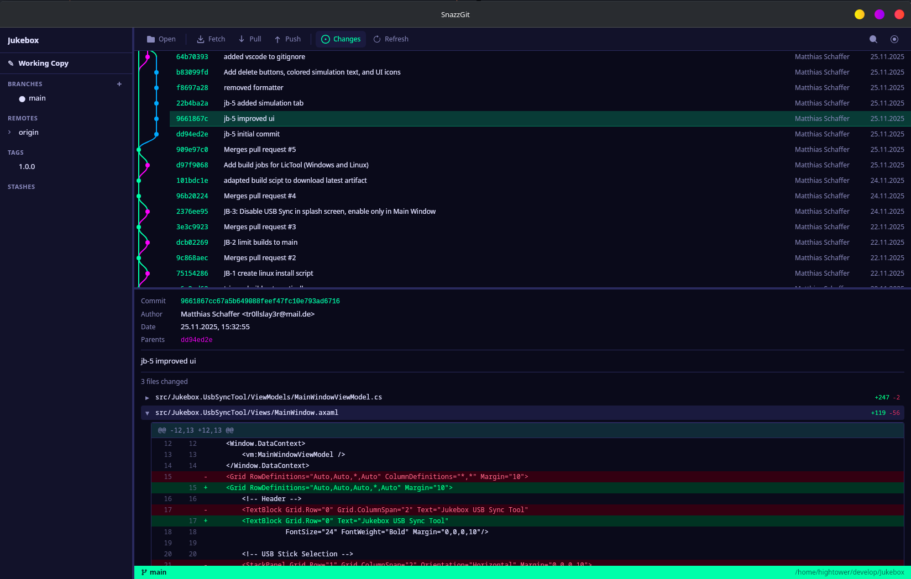

# SnazzGit

A snazzy, cross-platform Git GUI client built with [Tauri 2](https://tauri.app), [Svelte 5](https://svelte.dev), and [git2](https://github.com/rust-lang/git2-rs).



## Features

- **Commit History & Graph** -- visual branch/merge graph with virtual-scrolled commit list
- **Staging Area** -- stage, unstage, and discard changes with resizable split panels
- **Diff Viewer** -- syntax-highlighted diffs with hunk-level staging
- **Branch Management** -- create, checkout, rename, delete, merge branches
- **Reset** -- soft, mixed, or hard reset to any commit via context menu
- **Remote Operations** -- fetch (with prune), pull, and push
- **Stash** -- save, apply, pop, and drop stashes
- **Blame** -- per-line blame annotations
- **Search** -- live search commits by message, author, or SHA (Ctrl+K)
- **Gitignore** -- add files, patterns, or directories to `.gitignore` from the context menu
## Theming

SnazzGit ships with 4 built-in themes -- **Dark**, **Lollipop**, **Neon**, and **Classic** -- and includes a full theme editor with live preview. Every color in the UI is driven by CSS custom properties, so you have complete control over the look and feel.

Create your own themes in the editor and they're automatically saved to `~/.config/snazzgit/themes/` as JSON, ready to share or sync across machines.

## Keyboard Shortcuts

| Shortcut | Action |
|----------|--------|
| `Ctrl+K` | Search commits |
| `Ctrl+B` | New branch |
| `Ctrl+Enter` | Commit (when in commit message box) |

## Building from Source

### Prerequisites

- [Rust](https://rustup.rs/) (1.77.2+)
- [Node.js](https://nodejs.org/) (18+)
- [Tauri 2 prerequisites](https://tauri.app/start/prerequisites/)

### Development

```bash
npm install
cargo tauri dev
```

### Production Build

```bash
cargo tauri build
```

This produces platform-specific packages in `src-tauri/target/release/bundle/`:
- **Linux**: `.deb`, `.rpm`
- **Windows**: `.msi`, `.exe` (build on Windows or via CI)
- **macOS**: `.dmg`, `.app` (build on macOS or via CI)

## Tech Stack

| Layer | Technology |
|-------|-----------|
| Backend | Rust + git2 |
| Frontend | Svelte 5 (runes) + TypeScript |
| Styling | Tailwind CSS 4 + CSS custom properties |
| Framework | Tauri 2 |
| IPC | Tauri commands (async, via `tokio::spawn_blocking`) |

## Project Structure

```
src/                    # Frontend (SvelteKit)
  lib/
    components/         # UI components (commit, diff, staging, branch, etc.)
    stores/             # Svelte stores (repo state, UI state, themes)
    themes/             # Built-in theme definitions
    types/              # TypeScript type definitions
    utils/              # Tauri IPC bindings
  routes/               # SvelteKit pages
src-tauri/              # Backend (Rust)
  src/
    git/                # Pure git2 logic (no Tauri dependency)
    commands/           # Tauri IPC command handlers
```

## License

[MIT](LICENSE)
